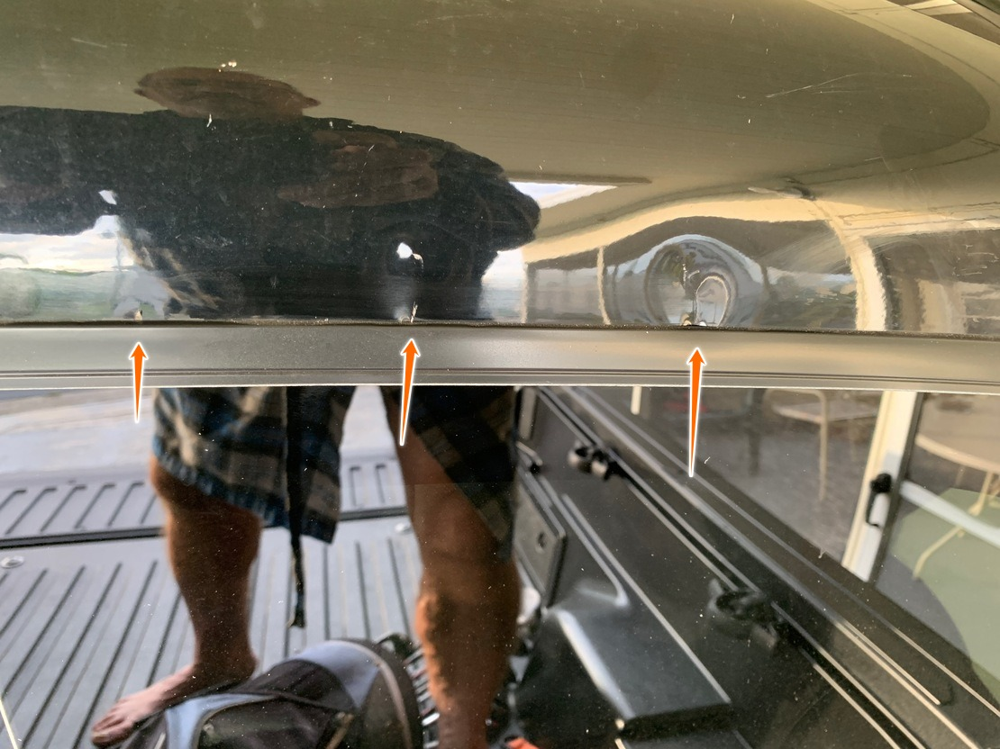

# Damages

Suing for: **$1726.42**

  
$40.00: Process server fees

  
  

  
$191.48: Court fees

  
  

  

  
$1,268.70: Repair estimate

  
  

  

  

  

  
$226.24: Rental car (4 days)

  
  

# The accident

* I borrowed a truck from my father, a 2020 Toyota Tacoma, for some debris I needed to move.
* I had a piece of wood with a nail sticking out. When I threw it into the back of the truck, it shattered one of the panes into many pieces.

# Contacting companies to repair the broken window.

I began calling multiple companies for quotes to repair the window, including Safelite and Blue Ribbon.

Safelite's quote was cheaper, so I scheduled for them to come out on Jun 2nd.

  
Initial Safelite quote: $583.12

  
  

The technician arrived with a non-powered window. I initially scheduled the appointment via their automated website, but unfortunately, it wasn't smart enough to know that the Tacoma required a *powered* window.

The technician updated the quote to include the correct window.

  
Final Safelite quote: $1,310.72

  
  

I declined their new quote because it was more than what Blue Ribbon was offering, $753.90.

I called Blue Ribbon on Jun 2nd to schedule a time to repair the window, which was Jun 3rd.

# Date of the repair

Blue Ribbon (two technicians, technician A and technician B) arrived to replace the window on Jun 3rd. I watched them as they replaced the window.

*This will become important later.* As I was watching the technicians replace the window, I noticed them having a lot of trouble. They later mentioned the difficulty they were having. It might be because the Truck was brand new with less than 5,000 miles. I witnessed technician B use a 1ft-long pole with an exacto blade at the tip from the outside of the window, as if it were a pry-bar.

After the work was completed, technician A guided me to the truck to sign and pay the invoice. I imediately noticed obvious damage to the truck, which was exactly where I noticed technician B use the 1ft-long pole Technician A was quick to say the following to me:

> I'm sorry about that. It's our policy to take pictures of existing damages before we begin work, and we didn't, so I will have the owner come out and square up with you.

# The owner, Greg Blum, arriving at my home to "square up".

A few days later, on Jun 5th, Greg Blum arrived at my home to resolve the matter.

We both took a look at the damage. Greg pointed out some smaller notches around the window, which were less noticeable. He said to me "this isn't a problem, I have a guy that can fix this, no problem." I was initially planning on holding payment until the damage was resolved, but Greg then said in a persistent/abrasive tone, "I can't float this debt, I need you to pay the invoice." I attempted to compromise, stating "Ok, I will pay the invoice, but only as long as you write on the receipt that you are responsible for the damages, with your signature." He did so.

  
Final receipt

  
  

  

> Signed statement from Greg: Blue Ribbon to pay to have 2 dents repaired on back of cab passenger side.

With Greg's signed acknowledgment of responsibility in my hand, I gave Greg the card to process the payment. While the payment was waiting to be confirmed, I casually mentioned to him "You guys give a good price, Safelite wanted to charge me $1,300."

I also mentioned to Greg that because of the damages, my new window isn't sealed properly, allowing water to get in. He brushed it off as a non-issue, presumably because he intended on repairing the damage.

Shortly after Greg left, his guy reached out to me to fix the damages and left a voice mail ([Here](./resources/dent-eraser-voicemail.mp3)).

> Hi Paul, my name is Micky Quin, my company is Dent Eraser, Blue Ribbon Glass gave me a call to take a look at your dents on the roof/back panel of your Toyota Tacoma, give me a call back, and we will see if we can get that fixed for you.

I called him back and he asked that I send him pictures of the damage. He then responded, saying "I definitely can't repair this, this will need traditional auto-body-shop work. I will let Blue Ribbon know."

  
Invoice from Dent Eraser

  
  

> Inspected dents on behalf of Blue Ribbon Glass. I am unable to perform the repairs. Vehicle will need conventional auto body repair.

# Trying to follow up with Greg

## The first follow up

After assuming that Dent Eraser would have contacted Greg about the damages, I waited a few days for Greg's call. After hearing nothing, I began calling his office to try to get a hold of him, leaving messages with the office for Greg to get back with me.

After maybe a week, I managed to call the office while Greg was present. Greg was given the phone. The conversation went something like:

> Paul: Hey, the guy you sent out said he can't fix the damages.

> Greg: Well, you wanted all this extra work, entire roof painted, etc, and I'm not doing that!

> Paul: Woa woa woa, hold on, I didn't demand anything from him. He said simply that he couldn't fix the dents.

> Greg: Well, I got another guy, I'll let you know what's going on when I get a hold of him.

> Paul: Ok, thanks, keep me posted.

## The second follow up

After another week-or-so rolled around, I didn't hear back from Greg. It was really difficult getting a hold of him. I kept leaving messages with his office, no response.

I managed to finally get a hold of him. The conversation went something like.

> Paul: What is going on with your other guy?

> Greg: I sent him a message. I haven't heard back from him. I think he is ducking me.

> Paul: Ok, well, it's been really hard getting a hold of you, and I'm not waiting around forever. I don't mind waiting to see if this new guy gets back with you, but please, keep me in the loop. I don't like going extended periods of time without hearing from you. It worries me.

> Greg: Ok

# Certified letter of intent to involve the courts

After another week-or-so goes by and not hearing anything back, it became more clear that Greg had no intention of resolving this matter. I decided to send Greg a certified letter. The letter was marked delivered as of June 29th.

  
Proof of delivery

  
  

  

Key points:

* I got an estimate to repair the damage and attached it to the certified letter. I mentioned that I would accept estimates from Greg, provided that they were from a reputable body shop.
* I made it clear that if this matter isn't solved (or progress made) by a July 3rd, I intend to file with small claims.

# Disputing the charge with bank

Considering that he didn't fulfill his part of the signed contract that "as a part of the $753.90 payment given to the defendant, Blue Ribbon is also to repair the dents," I decided to dispute the charge with the bank.

I provided similar information provided here to the bank.

Greg's response to the claim contained many falsehoods.

  
Greg's response to bank

  
  

  

> I did tell Mr Knopf that I would agree to have the dents repaired by Dent Dr because it is only $75 charge and it was not worth the trouble not to spend the $75.

Greg is confused in saying the company he sent was Dent Dr when it was actually Dent Eraser.

Greg's signed statement says "Blue Ribbon to pay to have 2 dents repaired on back of cab passenger side." It makes no mention that Greg would only be responsible for damages up to $75 in cost. Otherwise, it would/should have been written in the signed statement.

> I sent the Dent Dr to Mr Knopf's house that day to do the repair and Mr Knopf ran him off and told him he wanted the repair done at the dealership.

As I stated previously, Dent Dr was clear in saying that there was strictly nothing he could do to fix the damages. It was outside of his capability.

  
Proof, invoice from Dent Eraser

  
  

I would love nothing more than to see the damages repaired.

All this aside, unfortunately, the bank ultimately decided in favor of Greg, citing that "the simple act of providing CC is all that is needed to establish that the work was done satisfactory."

# The question of "who did the damages"

I believe the question of whether I did the damages to my vehicle, or if the technicians did, is ultimately irrelevant. Greg has signed and acknowledged that he is responsible for the damages. In my view, the only question now is what the monetary damages owed are. With that said, it's clear that Greg intends to make this a point in order to avoid paying what's due, so let me explain the damages.

  
Pictures of the damages

  
  *Picture 1*

  

  *Picture 2*

  

  *Picture 3*

  

  *Picture 4*

  

  *Picture 5*

  

  *Picture 6*

  

## Point A

I witnessed technician B use a long bar, prying out the window exactly where the damages are. After some research, I believe it to be a pipe knife, common in the auto-glass industry.

  
Pictures of a pipe knife

  
  

When I witnessed technician B using the pipe knife, I didn't think anything of it, assuming it was all routine and that they've done this many times before.

If you look at the damage, it seems obvious that the dents are due to a prying-like action. The bigger dents are to the right, where the prying would begin, becoming smaller as you move to the left, as less pressure is needed as the window comes loose.

## Point B

After the window was replaced and the damage was mentioned to the technicians, technician A confided in me, saying

> It's part of our process to take photos of any existing damages before we begin our work, and since we *didn't* take any photos, I will have the boss come square up with you.

Technician A implied that he didn't see the damage before by admitting that he did not take any photos.

This point was mentioned during mediation. I asked Greg if taking photos of existing damages was a rule established for all jobs, and Greg stated "yes". I then asked if his employee had these pictures, and Greg stated "I don't know".

If Greg were to have pictures of the damages before the window was replaced, I would have no case. And given that this rule is implemented within Blue Ribbon for precicly cases like this, I can only conclude that Greg did in fact ask his employee if he had the pictures, but refused to say decidedly that his employee didn't in-fact have them. It doesn't happen often, but in this case, I believe that lack of exculpatory from the defendant actually strengthens my case.

## Point C

Greg claims that the damages to the window were done by the debris that I presumably threw into the back of the truck. However, this would require an extraordinary amount of happenstance.

First, consider that all the dents appear perfectly along the seal of the window, with each dent becoming smaller as you move from right to left.

What this means is that I would have to either A) throw an object with 3-4 pointed ends so that each end of the points line up *exactly* with the window seal, curvature and all, or B) throw 3-4 objects at the truck, with each point of contact hitting precisely along the window seal, with each impact having slightly less force as you move from right to left.

The damage is much more consistent to what you'd see when prying the window out, with 3-4 lever-points, from right to left, with each lever-point requiring less and less effort, hence the smaller dents as you move from right to left. I actually witnessed technician B holding the pipe knife directly where the dents where, and that the technicians mentioned to me the incredible difficulty that had removing the window.

# Mediation, before court

There was a mediation done be Greg and I to attempt to resolve this matter before reaching the judge.

Up until the mediation, my last communication was to Greg was the certified letter. I was curious what his defense would be, considering it seemed like he had none. However, I was dumbfounded by the amount of lies.