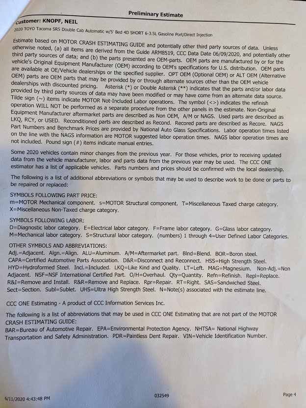

# Damages

Suing for: **$1726.42**

  
$40.00: Process server fees

  
  

  
$191.48: Court fees

  
  

  

  
$1,268.70: Repair estimate

  
  

  

  

  

  
$226.24: Rental car (4 days)

  
  

# The accident

* I borrowed a truck from my father, a 2020 Toyota Tacoma, for some debris I needed to move.
* I had a piece of wood with a nail sticking out. When I threw it into the back of the truck, it shattered one of the panes into many pieces.

# Contacting companies to repair the broken window.

I began calling multiple companies for quotes to repair the window, including Safelite and Blue Ribbon.

Safelite's quote was cheaper, so I scheduled for them to come out on Jun 2nd.

  
Initial Safelite quote: $583.12

  
  

The technician arrived with a non-powered window. I initially scheduled the appointment via their automated website, but unfortunetly, it wasn't smart enough to know that the Tacoma required a *powered* window.

The technician updated the quote to include the correct window.

  
Final Safelite quote: $1,310.72

  
  

I declined their new quote because it was more than what Blue Ribbon was offering, $753.90.

I called Blue Ribbon on Jun 2nd to schedule a time to repair the window, which would Jun 3rd.

# Date of the repair

Blue Ribbon (two technicians, technician A and technician B) arrived to replace the window on Jun 3rd. I watched them as they replaced the Window.

*This will become important later.* As I was watching the technicians replace the window, I noticed them having a lot of trouble. They later mentioned the difficulty they were having. It might be because the Truck was brand new with less than 5,000 miles. I witnessed technician B use a 1ft-long pole with an exacto blade at the tip from the outside of the window, as if it were a pry-bar.

After the work was completed, technician A guided me to the truck to sign and pay the invoice. I imediately noticed obvious damage to the truck, which was exactly where I noticed technician B use the 1ft-long pole. After mentioning it politely to the couple, technician B began to get argumentative/defensive. Technician A was quick to diffuse the frustration of technician B, and said the following to me:

> I'm sorry about that. It's our policy to take pictures of existing damages before we begin work, and we didn't, so I will have the owner come out and square up with you.

# The owner, Greg Blum, arriving at my home to "square up".

A few days later, on Jun 5th, Greg Blum arrived at my home to resolve the matter.

We both took a look at the damage. Greg pointed out some smaller notches around the window, which were less noticable. He said to me "this isn't a problem, I have a guy that can fix this, no problem." I was initially planning on holding payment until the damage was resolved, but Greg then said in a persistant/abrasive tone, "I can't float this debt, I need you to pay the invoice." I attempted to compromise, stating "Ok, I will pay the invoice, but only as long as you write on the receipt that you are responsible for the damages, with your signature." He did so.

  
Final reciept

  
  

  

> Signed statement from Greg: Blue Ribbon to pay to have 2 dents repaired on back of cab passenger side.

With Greg's signed acknowledgement of responsiblity in my hand, I gave Greg the card to process the payment. While the payment was waiting to be confirmed, I casually mentioned to him "You guys give a good price, Safelite wanted to charge me $1,300."